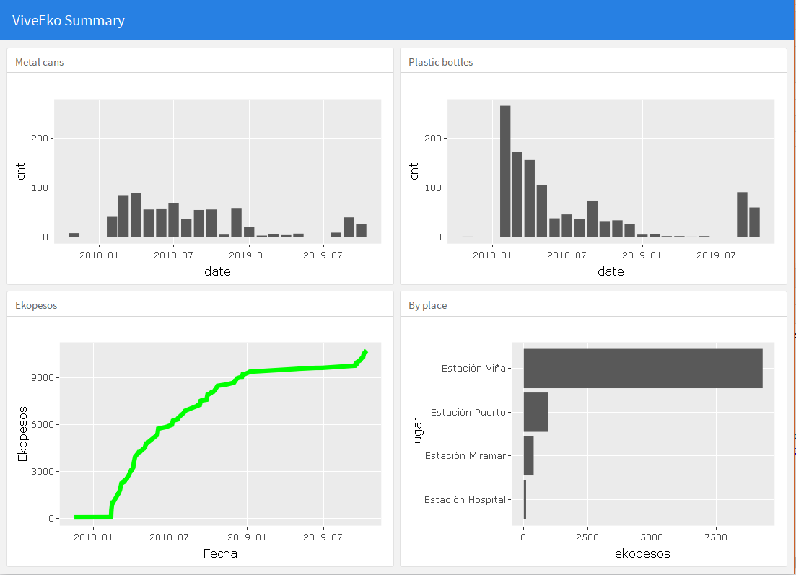

# Recycling-Dashboard
Summary of our recycling activities with the ViveEko App in Viña del Mar, Chile.

ViveEko is a company in Viña del Mar Chile which installed recycling machines for plastic bottles and metal cans in the metro stations. I downloaded the data from our recycling activities during the last 1.5 years from my account and cleaned it in order to be able to analyse it, i.e. understand which were our most active recycling months, which stations we preferred for recycling etc.

This was also my first attempt with the package flexdashboard.

